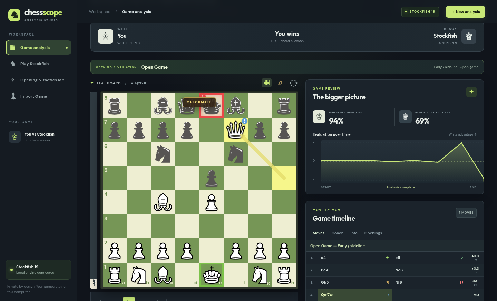
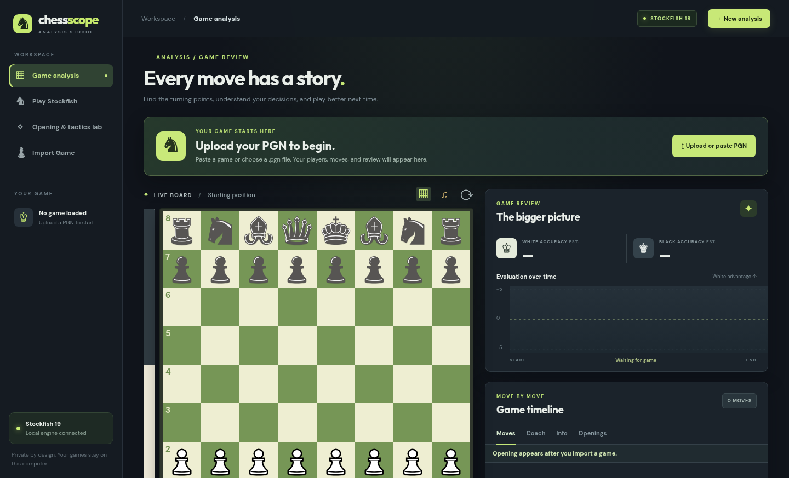
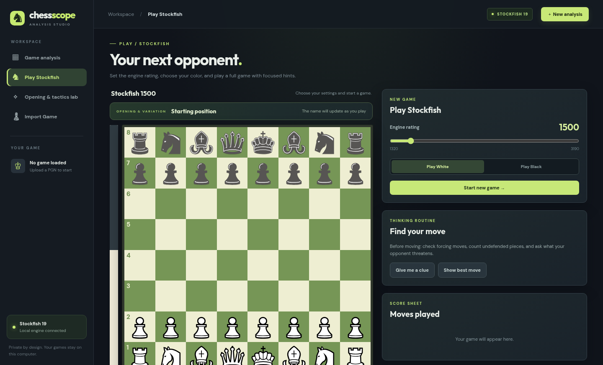
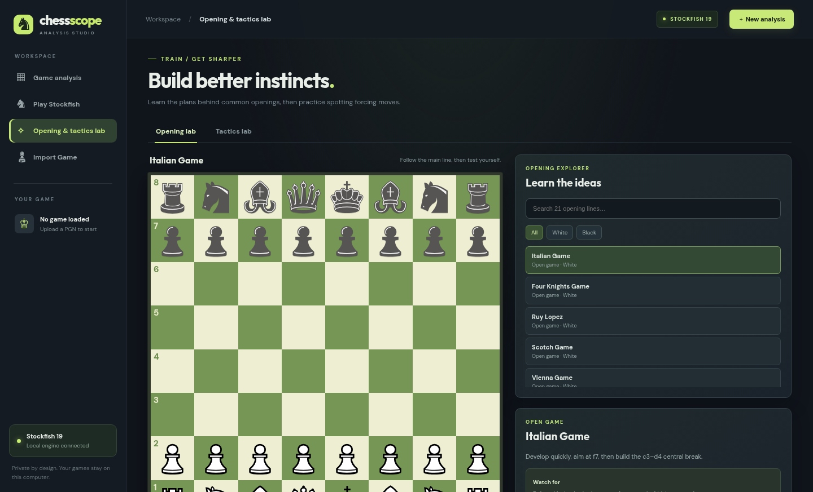

# Chessscope

A local chess studio: paste a PGN (or pull your Chess.com games) for Stockfish-powered review, play the engine at your level, and drill openings and tactics. No accounts, no build step, no runtime dependencies — your games never leave your computer.



## Run it

Requirements: **Node.js 18+** and a **Stockfish** binary.

```bash
# 1. Get Stockfish (any recent version works — the app only uses standard UCI)
#    Download from https://stockfishchess.org/download
#    or on Debian/Ubuntu:  sudo apt install stockfish

# 2. Start the app
npm start
```

Open **http://localhost:3000**.

| Env var         | Default                  | What it does                                  |
|-----------------|--------------------------|-----------------------------------------------|
| `STOCKFISH_PATH`| `/usr/local/bin/stockfish` | Path to your Stockfish binary               |
| `PORT`          | `3000`                   | Port the web server listens on                |

Example with a custom engine location:

```bash
STOCKFISH_PATH=/usr/bin/stockfish npm start
```

Or copy `.env.example` to `.env` and edit it (the server reads it on startup — no packages needed). Real environment variables always override `.env`.

Check the engine is alive: run `stockfish`, type `uci` (expect `uciok`), then `isready` (expect `readyok`).

## What you get



- **Game analysis** — Upload or paste a PGN, fetch recent games from any Chess.com username (public games, no login), or reopen games saved in your browser. Every move gets a Stockfish verdict (brilliant → blunder), win-chance chart, accuracy estimates, coach explanations, and opening + variation identification that follows you as you step through moves. Checks glow red; checkmate paints the mated king red and the winner's king green.
- **Play Stockfish** — Pick White/Black, set engine strength (UCI Elo 1320–3190), and play with tap or drag-and-drop, a live eval bar, opening name as you play, thinking clues, engine hints, and synthesized sounds for moves, results, and mistakes.
- **Opening & tactics lab** — 21 short opening lines with plans, dangers, board walkthroughs, and saved practice progress, plus forcing-move puzzles with hints and answers.





## Project layout

| File              | Purpose                                                      |
|-------------------|--------------------------------------------------------------|
| `server.js`       | Static server + Stockfish bridge (`/api/analyze`, `/api/engine-move`, `/api/coach-hint`, `/api/live-eval`) |
| `app.js`          | Analysis UI, sounds, and the bundled training code (generated — don't edit the bundle by hand) |
| `index.html`      | Page structure for analysis, play, and study views           |
| `style.css`       | All styles                                                   |
| `chess.js`        | Dependency-free chess rules: FEN, legal moves, SAN, PGN parsing (handles Chess.com clock comments) |
| `openings.js`     | 21 opening lines + named variations and position identification (backed by `eco-book.js`) |
| `eco-book.js`     | Generated 3,864-position ECO book — do not edit by hand (see below) |
| `tactics.js`      | Tactics puzzles                                              |
| `training.js`     | Play-a-game, opening practice, and tactics UI (source of the bundle in `app.js`) |
| `chess.test.js`   | Test suite (`npm test`)                                      |
| `assets/`         | Piece renderer, sprite embedder, training bundler, ECO book builder |

After editing `training.js`, `chess.js`, `openings.js`, or `tactics.js`, regenerate the bundle:

```bash
npm run build:training
```

To refresh the ECO book itself (needs the `a.tsv`–`e.tsv` files from lichess-org/chess-openings next to the script):

```bash
npm run build:eco -- /path/to/tsv-dir
npm run build:training
```

## Test

```bash
npm test
```

## Deploy notes

- Deploy anywhere that runs Node long-term (VPS, Railway, Render, Fly.io). Serverless functions (Vercel, Netlify Functions, Cloudflare Workers) won't work: analysis streams for many seconds and spawns engine processes.
- Point `STOCKFISH_PATH` at the engine on the host (e.g. apt-installed or downloaded binary).
- Stockfish is GPLv3 — keep its license notice if you redistribute the binary.
